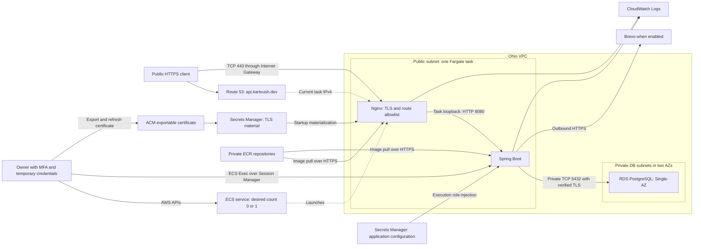

# AWS Phase 1 Target Architecture

## Purpose and Decision Inputs

This document defines the deployment architecture for #171. It combines the [environment baseline](../infrastructure/aws-phase-1-environment-baseline.md) for #187, the [cost preflight](../infrastructure/aws-phase-1-cost-preflight.md) from #185, and [ADR 0034](./decisions/0034-aws-phase-1-compute-strategy.md) from #186.

Phase 1 is one on-demand portfolio environment in Ohio (`us-east-2`). Application compute is normally inactive. Public HTTPS access is available only while the owner intentionally runs the environment. This document selects the architecture; it does not provision resources or implement lifecycle automation.

## Selected Architecture

- One ECS service using Fargate, normally at desired count zero
- One running task containing Spring Boot and an Nginx HTTPS reverse proxy
- A public subnet and one task public IPv4 address for ingress and outbound access while running
- Route 53 DNS for `api.kartoush.dev`, updated to the current task address
- One exportable, DNS-validated ACM certificate for that exact hostname
- Private ECR repositories for the application and pinned proxy image
- One private Single-AZ RDS PostgreSQL instance with 20 GiB gp3 storage
- AWS Secrets Manager for application secrets and exported TLS material
- CloudWatch Logs and standard ECS/RDS metrics for basic operations
- IAM-controlled ECS Exec for internal application and database operations

Phase 1 has no ALB, NAT Gateway, bastion, RDS Proxy, EFS, paid interface endpoints, WAF, CDN, or autoscaling. These services are not prerequisites for this single-task demo architecture. Adding any of them requires a new complete cost assessment.

The direct task address is an intentional availability tradeoff. There is no stable load-balancer address or zero-downtime deployment. The owner must reconcile DNS after startup, deployment, or an ECS task replacement before treating the public environment as available.

## Architecture Diagram

The service definition remains when no task is running. No diagram arrow implies a permanently running task. Public IPv4 is used only by the active Fargate task; RDS has no public address.

## Network Topology

Use a dedicated VPC, `10.20.0.0/16`, with DNS resolution and DNS hostnames enabled. Allocate the following IPv4 subnets across two selected Ohio Availability Zones. Zone names are account-specific; select and record the two zones during #173.

| Subnet | CIDR | Placement | Route table |
| --- | --- | --- | --- |
| Public A | `10.20.0.0/24` | ECS task preferred placement | Local VPC route; `0.0.0.0/0` to Internet Gateway |
| Public B | `10.20.1.0/24` | Optional alternate task placement | Local VPC route; `0.0.0.0/0` to Internet Gateway |
| Private DB A | `10.20.10.0/24` | RDS subnet group | Local VPC route only |
| Private DB B | `10.20.11.0/24` | RDS subnet group | Local VPC route only |

The DB subnet group spans two zones because RDS requires it, but the database is Single-AZ. This does not purchase Multi-AZ database availability. Prefer task placement in the database's active zone to reduce cross-zone traffic; cross-zone access still works through the VPC local route.

Set `assignPublicIp=ENABLED` explicitly for Fargate. Public-subnet routing alone does not give a Fargate task internet access. No Elastic IP is reserved. No IPv6 route or AAAA record is required for Phase 1.

Outbound image pulls, Secrets Manager access, CloudWatch delivery, ECS Exec channels, and Brevo requests use HTTPS through the task's public IPv4 and the Internet Gateway. Private RDS traffic stays within the VPC. The database subnets have no internet default route and no NAT Gateway.

### Security Groups

| Group | Inbound | Outbound |
| --- | --- | --- |
| `kartoush-demo-app` | TCP 443 from `0.0.0.0/0` | TCP 5432 to DB group; TCP 443 to `0.0.0.0/0` |
| `kartoush-demo-db` | TCP 5432 from app group only | No application-initiated outbound rule required; replies are stateful |

There is no inbound rule for HTTP 80, SSH, Spring Boot 8080, management ports, or PostgreSQL from the internet. VPC resolver DNS follows AWS's security-group behavior. Keep default network ACLs for Phase 1; security groups are the explicit access boundary.

Binding Spring Boot to `127.0.0.1:8080` adds a second boundary: only containers sharing the task network can reach it. A public subnet does not expose every task port. The task security group and proxy route policy determine public access.

## Ingress and TLS

Use an A record with a 60-second TTL for `api.kartoush.dev` in the Route 53 hosted zone for `kartoush.dev`. The record points to the currently healthy task's public IPv4 address. Keep ACM's separate validation CNAME records while the certificate is retained.

Nginx terminates TLS on 443 using an exported ACM public certificate and key. Configure TLS 1.2 or newer. Port 80 stays closed, so clients must use HTTPS. The proxy forwards accepted requests to Spring Boot over task loopback; there is no plaintext application hop across the public internet.

Use a certificate with one exact DNS name, with export enabled at issuance. Do not request a wildcard or extra names: they are billed separately. ACM certificates integrated directly with a load balancer are free, but an exported certificate used in a container is billable.

The operator exports the certificate, chain, and encrypted private key, decrypts the key securely, and stores the usable TLS bundle in a dedicated Secrets Manager secret. A short-lived startup container materializes the bundle on a task-scoped encrypted volume. The proxy mounts it read-only with restrictive file permissions. No key or export passphrase enters the repository, image, task-definition plaintext, or logs.

The proxy must wait for successful certificate materialization, and the bundle must match the hostname and be valid before public DNS is published. Both the proxy and application are essential containers; failure of either makes the task unavailable.

ACM renewal does not replace certificate files in an independently operated container. Retain DNS validation, monitor certificate expiry, and re-export renewed material into Secrets Manager. Replace the task deliberately to load the new bundle, then refresh DNS. Validate expiry before each manual startup and review renewal events while inactive. Do not issue a new certificate on every startup.

### Public Route Boundary

The proxy uses a default-deny route and method allowlist. It exposes the existing intended external customer/authentication and terms APIs; new commerce routes are added only when their implementation and security classification are ready.

The initial route families are `/api/auth/`, `/api/customers`, `/api/customers/`, and read-only `/api/terms-of-service/`. #341 must derive the exact method/path allowlist from the deployed API contracts rather than blindly forwarding every `/api/**` request.

Reject `/internal/**`, `/dev/**`, `/actuator/**`, OpenAPI/Swagger paths, JobRunr dashboard paths, and all unlisted routes. Apply the same policy for direct IP requests, unknown Host headers, normalized paths, and encoded-path variants. There is no alternate public listener that forwards directly to Spring Boot.

The proxy replaces untrusted forwarding headers with values derived from its connection. Spring Boot trusts forwarded headers only from this local proxy. Preserve bearer tokens and request bodies without logging them. Application authentication and authorization remain application responsibilities; ingress filtering does not replace them. Application abuse prevention remains in #344.

### Address Changes and Inactive Behavior

Fargate task IP addresses are disposable. On manual startup or deployment, discover the task's ENI, wait for local application and proxy readiness, then publish its current address. On planned shutdown, remove the A record before stopping the task. Keep the hosted zone and ACM validation records.

ECS may replace an unhealthy task while desired count is one. The replacement will need a fresh DNS update even though the owner did not perform another startup. Phase 1 accepts downtime until the owner reconciles the record. The operational runbook must identify this case, verify the running task, and remove stale addresses. The later lifecycle work may automate this reconciliation without raising desired count from zero.

Do not leave records pointing to released task addresses. Cached DNS can still outlive shutdown for the TTL; hostname-valid TLS remains required, and there is no HTTP fallback. A stopped environment has no public application endpoint, not a permanently served maintenance page.

## Compute and Image Storage

Start with one Linux/x86 Fargate task using 0.25 vCPU, 1 GiB total task memory, and the included 20 GiB ephemeral storage. The memory and CPU budget covers the application, proxy, certificate initialization, and ECS Exec overhead together. #175 and #177 must validate startup, Flyway, representative requests, and memory headroom with these limits before deployment acceptance.

Pin both application and proxy images by digest in private Ohio ECR repositories. Use immutable release tags and a bounded retention policy, retaining the current and previous working images. Avoid a dependency on anonymous public-registry pulls at runtime. No build or dependency download runs inside the production task.

Every container image permitted as an ECS Exec target must include the `script` and `cat` utilities in its executable path. This applies to application, proxy, and maintenance images wherever operator Exec access is allowed. Minimal base images must be checked explicitly; IAM and log-driver configuration alone do not guarantee session output delivery.

Set service deployment minimum healthy percent to zero and maximum percent to 100 for one-task replacement. This deliberately allows downtime and avoids paying for two normal application tasks during deployments. An inactive deployment must preserve desired count zero. ECS container health checks use task-local endpoints rather than exposing Actuator publicly.

The AWS `demo` environment runs the application's production profile with externalized configuration. Use normal application logging levels; the verbose TRACE and SQL-binding defaults in the base configuration are unsuitable for the deployed cost and secret-handling assumptions.

No autoscaling policy or schedule starts the service. The Spring process and proxy are disposable; persistent application and background-job state stays in PostgreSQL.

## Database

Use private Single-AZ RDS PostgreSQL on `db.t4g.micro` with 20 GiB gp3 storage, no public accessibility, and no storage autoscaling. Choose a currently supported PostgreSQL major version compatible with the application's migrations and avoid RDS Extended Support charges. Enable storage encryption with the AWS-managed key and a short automated-backup retention window, initially one day.

Use the RDS endpoint hostname over private TCP 5432. Configure PostgreSQL JDBC with `sslmode=verify-full` and the AWS RDS trust bundle. Require TLS through the DB parameter group. The application must not fall back to an unverified or plaintext database connection.

Bootstrap the database and an application database role through controlled VPC operations. Do not run the normal application as the RDS master user. Grant the application role the schema permissions needed by the repository's Flyway and module-owned persistence model. Flyway runs at application startup; #180 validates its RDS integration rather than introducing another migration platform.

Managed database maintenance, backups, and persistent storage continue independently of ECS. RDS automatically restarts after at most seven consecutive stopped days. The cost model therefore conservatively allows RDS compute to run all month even when application compute is inactive. Later lifecycle work must reconcile that restart behavior and consider snapshot/delete/restore for long idle periods; it must never infer that desired count zero deletes database state.

## Secrets and IAM

Select Secrets Manager as the single Phase 1 runtime secret store. Group closely related application values in one secret and keep TLS material in a second secret. Retain operator-only RDS master credentials in a third secret, unavailable to the normal application task. Use AWS-managed encryption keys; no customer-managed KMS key is required by this design. Normal non-secret settings, including the RDS endpoint and profile name, remain environment configuration.

Application secrets include database credentials, internal administrator credentials, the activation-email job encryption key, and the Brevo API key when delivery is enabled. Supply only the required JSON fields as container secrets. Keep the persistent job encryption key stable across task replacements so queued work remains decryptable.

The normal ECS execution role can pull the two ECR images, deliver container logs, and retrieve only the application and TLS secrets; it cannot read the RDS master secret. The application task role is separate and grants the Session Manager channels and log permissions needed for ECS Exec, not infrastructure administration, certificate issuance, DNS changes, or arbitrary secret access.

The certificate startup container receives TLS fields through execution-role secret injection and writes the bundle before exiting. The application container never receives the TLS private key. Secrets injected at launch do not hot-reload: secret rotation requires a deliberate new task and DNS reconciliation if the environment is active. An inactive secret update must leave it inactive.

The operator uses MFA and temporary AWS credentials. Restrict deployment, DNS, export, and secret-management permissions to the environment's resources. No long-lived AWS access key is embedded in a container or stored as application configuration. Runtime startup is manual in Phase 1; GitHub CI/CD credentials belong to Phase 2.

## Operational Access and Logging

Use ECS Exec through IAM and Session Manager for controlled access to a running task. There is no SSH listener, bastion, public internal API, or public database endpoint. Internal API commands run against task loopback with the application's administrator credentials; AWS IAM access alone does not replace application authentication.

For database bootstrap or maintenance, use a short-lived, pinned maintenance task with the app security group and outbound HTTPS access, controlled by the operator. Give it a separate execution role allowed to inject the database credentials required for that operation, then stop it. It must not expose a public listener or leave an extra task running. Account for its task-hours in the operations allowance.

Send application, proxy, and ECS Exec audit output to CloudWatch log groups with seven-day retention. Restrict transcript access and avoid commands that print credentials. Log route/status/timing information without Authorization headers, tokens, TLS material, or sensitive request bodies.

Before operational acceptance, run a harmless ECS Exec command that prints a unique non-secret marker in each permitted target container. Verify its command and output arrive in the configured CloudWatch log group and record the evidence. Confirm `script` and `cat` are available in each image and logging is enabled. A working shell or CloudTrail access event alone does not establish transcript delivery. #179 configures this validation and #181 includes it in end-to-end acceptance.

Use standard ECS CPU/memory and RDS metrics. Do not enable paid Container Insights, detailed dashboards, tracing, or broad log exports by default. Billing alerts and anomaly detection from #185 are prerequisites; the narrower #179 monitoring scope does not override those safeguards. Phase 2 observability remains under #323.

## Data and Control Flows

| Flow | Path and boundary |
| --- | --- |
| Manual start | Operator starts required dependencies, confirms certificate readiness, raises desired count to one, verifies health, and reconciles DNS |
| Public request | DNS resolves current task IPv4; HTTPS reaches Nginx; the route allowlist forwards to loopback Spring Boot; application security evaluates the request |
| Database request | Spring Boot uses the private RDS hostname and verified TLS; the DB group accepts only the app group |
| Image and configuration load | Fargate execution role pulls ECR images and injects Secrets Manager fields through outbound HTTPS |
| Transactional email | Spring Boot sends outbound HTTPS to Brevo using the existing provider adapter when enabled |
| Operator request | IAM-authorized ECS Exec opens an outbound-established Session Manager channel; commands use internal loopback or the private DB endpoint |
| Planned stop | Operator removes the public A record and sets desired count zero; tasks and public addresses disappear; persistent resources are inventoried separately |

Around 10:00 PM local time, the later lifecycle task should notify the owner if active. Around 10:15 PM it should stop the runtime unless explicitly kept running, including DNS cleanup. It must leave the service inactive until manual startup. This task documents that contract without implementing it.

## Complete Cost Model

The planning model assumes low portfolio/demo traffic, one normal application task, one small Single-AZ DB, bounded images and logs, and 120 application task-hours in a normal part-time month. The failure scenario uses 730 hours for both application and RDS compute. Prices and allowances exclude promotional credits and Free Tier deductions.

Ohio AWS pricing catalogs checked on 2026-10-05 give Fargate Linux/x86 at $0.04048/vCPU-hour plus $0.004445/GiB-hour, RDS `db.t4g.micro` at $0.016/hour, and RDS gp3 at $0.115/GiB-month. One public IPv4 costs $0.005/hour. ACM currently charges $7 per exact hostname at exportable-certificate issuance or renewal; repeated export of the same certificate is not another issuance.

| Component | Inactive application | Part-time, 120 hours | 24/7 failure, 730 hours |
| --- | ---: | ---: | ---: |
| RDS compute, conservatively running all month | $11.68 | $11.68 | $11.68 |
| RDS storage, 20 GiB | $2.30 | $2.30 | $2.30 |
| Fargate, 0.25 vCPU and 1 GiB | $0.00 | $1.75 | $10.63 |
| One task public IPv4 | $0.00 | $0.60 | $3.65 |
| ACM, one issuance or renewal in this month | $7.00 | $7.00 | $7.00 |
| CloudWatch allowance | $1.00 | $1.00 | $1.00 |
| ECR allowance | $0.20 | $0.20 | $0.20 |
| Three Secrets Manager secrets and reads allowance | $1.40 | $1.40 | $1.40 |
| Hosted zone and DNS queries allowance | $0.60 | $0.60 | $0.60 |
| Billable backup/snapshot allowance | $1.00 | $1.00 | $1.00 |
| Transfer allowance | $1.00 | $1.00 | $1.00 |
| Occasional maintenance and operational allowance | $1.00 | $1.00 | $1.00 |
| **Total in a certificate billing month** | **$27.18** | **$29.53** | **$41.46** |
| **Total without certificate issuance or renewal** | **$20.18** | **$22.53** | **$34.46** |

Allowances are budgeted consumption, not fixed service fees. Keep aggregate retained ECR images within 2 GiB, CloudWatch ingestion within approximately 1 GiB/month with bounded retention, billable backups within approximately 10 GiB beyond any included allocation, and total external/cross-zone transfer low enough to fit the $1 allowance. Secret reads and DNS queries should remain small. Review actual usage rather than assuming these estimates cap AWS bills.

The 24/7 failure estimate remains below $50 even in a certificate billing month. A 31-day, 744-hour month adds approximately $0.50 for the three hourly components. There is room for roughly $8 of additional spend, not permission to introduce continuously billed networking or unbounded log retention. Taxes and domain registration are not included in AWS service estimates; check account-specific tax treatment before provisioning against the personal cash budget.

RDS stops may save instance-hours but are not needed to satisfy the ceiling. A second $7 certificate issuance in the same month would bring the 730-hour scenario to approximately $48.46, leaving little margin; avoid unnecessary reissuance and recalculate before additional billable changes. Do not amortize certificate charges to hide their billing-month impact.

Sizing changes also require recalculation. At these rates, 0.25 vCPU with 2 GiB adds approximately $3.24/month in the 24/7 case; 0.5 vCPU with 1 GiB adds approximately $7.39. Do not accept a larger task until the complete estimate, operational allowances, and certificate charges still fit below $50. RDS surplus CPU credits, extra secrets, larger backups, storage changes, or higher traffic must trigger the same review.

### AWS Pricing Calculator Reconciliation

The owner supplied a [combined scenario export dated 2026-10-06](../infrastructure/estimates/aws-phase-1-scenarios-2026-10-06.pdf), with a [saved calculator estimate](https://calculator.aws/#/estimate?id=bb16226568e964bb86f660829e75244e0f7f4370). The original [part-time export dated 2026-10-05](../infrastructure/estimates/aws-phase-1-part-time-2026-10-05.pdf) is retained as the earlier record. The PDFs preserve their dated inputs and results if shared estimates expire or pricing changes.

The combined export contains two alternative scenarios for the same environment, not two deployed environments. Its headline $52.47/month and $14 upfront add both groups together and must not be used as the cost of running one environment.

| Exported group | Monthly services | Upfront certificate | Certificate billing month |
| --- | ---: | ---: | ---: |
| Part-time | $21.79 | $7.00 | $28.79 |
| 24/7 | $30.68 | $7.00 | $37.68 |

The following service breakdown is the part-time group; the 24/7 group differs only in its Fargate charge.

| Service | Exported monthly cost | Verified export configuration |
| --- | ---: | --- |
| Fargate | $1.74 | Linux/x86, 30 tasks/month, four hours per task, 20 GB ephemeral storage |
| RDS PostgreSQL | $13.98 | One Single-AZ `db.t4g.micro`, 730 hours/month, 20 GB gp3, no additional backup storage or snapshot export |
| VPC public IPv4 | $3.65 | One in-use address, charged for the full month |
| Secrets Manager | $1.22 | Three secrets, 730 hours each, 100 API calls/month |
| CloudWatch | $0.50 | 1 GB standard log ingestion |
| Route 53 | $0.50 | One hosted zone |
| ECR | $0.20 | 2 GB stored |
| ACM | $0.00 | One exact hostname, no wildcard, one export API call; $7 upfront issuance charge |
| **Total** | **$21.79** | **Plus $7 upfront** |

The PDFs' Fargate summaries omit vCPU and memory values. The owner also supplied the 24/7 calculator configuration and calculations, confirming Linux/x86, one task per month for 730 hours, 0.25 vCPU, 1 GB memory, and 20 GB ephemeral storage. Its $10.63 monthly charge matches the planning task size. Preserve those resource settings when comparing scenarios.

The exported certificate billing month totals $28.79 before additional backup, transfer, and occasional maintenance costs. Adding their three $1 allowances gives $31.79. Retaining the planning margins for CloudWatch, Secrets Manager, and DNS adds another $0.78, giving $32.57. This conservative full-month IPv4 estimate does not by itself establish a below-$30 certificate billing month; it remains comfortably below the hard $50 ceiling.

The calculator's public IPv4 configuration in this export does not expose duration. Keep its $3.65 value intact. Separately, the usage-based model assumes the task-assigned address exists for 120 hours and is released when the task stops, with no retained Elastic IP. At $0.005/hour, that is $0.60. Applying only this documented $3.05 adjustment gives $29.52 including the certificate charge and all planning allowances, or $22.52 without certificate issuance/renewal. The one-cent difference from the planning table reflects the calculator's displayed Fargate amount.

These savings depend on releasing the address, not merely leaving a provisioned address idle; idle public IPv4 addresses are also billed. AWS documents hourly IPv4 pricing billed in one-second increments and release of Fargate task network interfaces on task stop. Validate address release during #181 rather than treating a calculator limitation as evidence of either billing behavior.

The reviewed 24/7 group uses $10.63 for Fargate and retains the full-month IPv4 charge. Its exported total is $30.68/month, or $37.68 in a certificate billing month, before the additional allowances. Adding the $3 backup/transfer/maintenance allowances and $0.78 planning margins produces $41.46, matching the complete failure-case model. This reconciled total is derived from the exported group and documented allowances; the PDF itself reports $30.68 plus $7 upfront.

The combined PDF's $643.64 twelve-month summary likewise sums both scenarios and includes their initial certificate charges. It is not one environment's annual cost or a certificate-renewal forecast. Account for renewal charges in the months they occur. The exports also do not independently show every log-retention or DNS-query setting; retain the architecture's bounded usage and safety margins.

### Alternatives and Tradeoffs

- An internet-facing ALB adds its hourly/LCU charges and at least two public IPv4 addresses, pushing the small x86 task baseline beyond the ceiling once the rest of this model is included
- CloudFront with an internal ALB avoids public ALB addresses but retains ALB hourly charges; meeting the normal target would require additional ingress create/destroy work or a smaller validated compute budget
- Private application subnets with a NAT Gateway add approximately $33/month before address and processing charges, so they do not fit this model
- Multiple paid interface endpoints avoid NAT but add recurring per-zone hourly charges; public-subnet HTTPS egress is simpler for this workload
- Direct HTTPS keeps inactive ingress charges near zero, but trades managed load-balancer certificates and address stability for exported certificate handling, DNS reconciliation, and accepted demo downtime

The selected architecture meets the normal target and the documented 24/7 safety scenario without nightly shutdown. It does not claim a spending guarantee for traffic or operational activity outside the preflight workload assumptions.

## Implementation Sequence

1. Review the #187 baseline and this architecture before accepting the #171 prerequisite
2. Complete account/MFA/IAM work in #172 and the #185 budget/anomaly-detection setup before provisioning billable resources
3. Create the VPC, subnets, routing, and groups in #173 with no NAT Gateway
4. Containerize and validate the application in #175; mirror pinned application/proxy images into ECR in #176
5. Provision private RDS in #174, configure runtime secret storage in #178, and prepare the ACM/TLS material and DNS access required by #341
6. Define the ECS service at desired count zero in #177; coordinate #177 and #178 before the first deliberate startup so no working credentials are placed in plaintext
7. Validate startup and Flyway against RDS in #180, then public HTTPS and route isolation in #341; configure basic logging in #179
8. Complete #181 end-to-end validation, including ECS Exec transcript delivery for every permitted target, start/stop, address replacement, persistent-cost inventory, and the complete cost assessment

The first implementation may use the console and AWS CLI. This architecture does not introduce Terraform or Phase 2 CI/CD. Produce repeatable operational instructions as each implementation task lands.

## Downstream Assumptions to Update

The following issues were reviewed against this architecture. This list records the required follow-up changes without editing issue bodies or provisioning infrastructure.

| Issue | Required alignment |
| --- | --- |
| #172 | Distinguish operator, execution, and task roles; use the baseline names and temporary credentials rather than one broad application role |
| #173 | Remove the required NAT Gateway; public application subnets and isolated private DB subnets have different route tables |
| #174 | Specify private Single-AZ `db.t4g.micro`, bounded gp3/backup storage, verified TLS, and the cost gate |
| #175 | Validate constrained memory, loopback binding, externalized production settings, health checks, the RDS trust bundle, and `script`/`cat` availability in Exec target images |
| #176 | Include the pinned proxy image and bounded image retention alongside the application repository |
| #177 | Replace private-task placement with public subnet placement and explicit public IPv4; retain desired count zero normally; include the proxy and startup ordering |
| #178 | Use Secrets Manager; coordinate with #177 before first startup; keep TLS material separate from application secrets and preserve the job encryption key |
| #179 | Apply finite log retention and safe runtime logging; verify ECS Exec command/output delivery from every permitted target; preserve the independent billing-monitoring prerequisite from #185 |
| #180 | Validate the existing startup Flyway behavior using private, verified-TLS RDS connections |
| #181 | Include #341 ingress validation before public acceptance; verify ECS Exec transcripts; add negative access, restart/address-change, and cost checks |
| #341 | Implement the task-local HTTPS proxy, exact route allowlist, exportable certificate lifecycle, and DNS reconciliation rather than assuming an ALB |
| Later lifecycle task | Preserve manual startup, desired count zero, DNS removal, and explicit handling of RDS restart and persistent resources |
| #323 | Build later CI/CD and observability on this topology while preserving inactive deployment behavior and the complete cost ceiling |

#177 and #178 describe interdependent runtime wiring. Prepare definitions and secrets before the first startup; do not interpret #178's dependency on #177 as permission to deploy with plaintext credentials. Database bootstrap credentials remain operator-only.

## References

- [AWS Fargate pricing](https://aws.amazon.com/fargate/pricing/)
- [Ohio ECS pricing catalog](https://pricing.us-east-1.amazonaws.com/offers/v1.0/aws/AmazonECS/current/us-east-2/index.json)
- [Ohio RDS pricing catalog](https://pricing.us-east-1.amazonaws.com/offers/v1.0/aws/AmazonRDS/current/us-east-2/index.json)
- [Amazon VPC pricing](https://aws.amazon.com/vpc/pricing/)
- [AWS Certificate Manager pricing](https://aws.amazon.com/certificate-manager/pricing/)
- [Exportable ACM public certificates](https://docs.aws.amazon.com/acm/latest/userguide/acm-exportable-certificates.html)
- [Exporting an ACM public certificate](https://docs.aws.amazon.com/acm/latest/userguide/export-public-certificate.html)
- [Fargate task networking](https://docs.aws.amazon.com/AmazonECS/latest/developerguide/fargate-task-networking.html)
- [ECS sensitive configuration and secret volumes](https://docs.aws.amazon.com/AmazonECS/latest/developerguide/specifying-sensitive-data.html)
- [ECS Exec](https://docs.aws.amazon.com/AmazonECS/latest/developerguide/ecs-exec.html)
- [RDS TLS connections](https://docs.aws.amazon.com/AmazonRDS/latest/UserGuide/UsingWithRDS.SSL.html)
- [RDS stop behavior](https://docs.aws.amazon.com/AmazonRDS/latest/UserGuide/USER_StopInstance.html)
- [Secrets Manager pricing](https://aws.amazon.com/secrets-manager/pricing/)
- [Elastic Load Balancing pricing](https://aws.amazon.com/elasticloadbalancing/pricing/)
